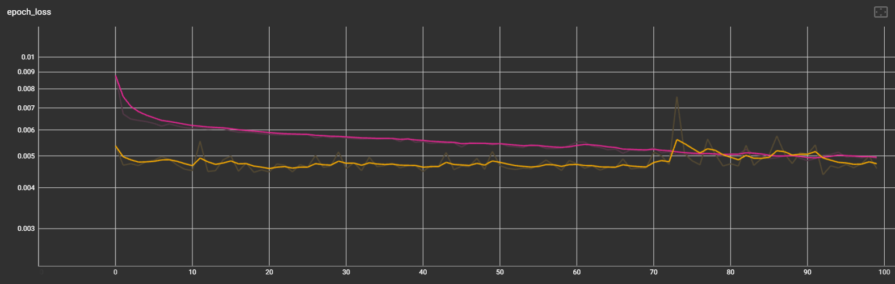

# 🧪 드롭아웃 적용 실험 로그

> **목적**
> 70 Epoch 부근에서 확인된 과적합(overfitting)을 완화하기 위해 **각 레이어 사이에 Dropout 레이어**를 삽입하여 재학습을 진행함.

---

## 1. 실험 개요

| 항목        | 내용                           |
| --------- | ---------------------------- |
| **기준 모델** | `25-06-24_prototype`         |
| **변경 사항** | 모든 LSTM 층 뒤에 `Dropout(p)` 추가 |
| **평가 지표** | `loss`, `val_loss` (MSE)     |

---

## 2. 변경 사항 상세

* **Dropout 비율** : *추정 p = 0.4*
* **적용 위치** : 각 LSTM 층과 Dense 층 사이
* **나머지 하이퍼파라미터** : 기존과 동일

---

## 3. 결과 요약

| 구분                  | 과적합(Epoch)      | `loss` 추세         | `val_loss` 추세      |
| ------------------- | --------------- | ----------------- | ------------------ |
| **Before**          | ≈ **70 Epoch**  | 100 Epoch 이후 *평평* | 급상승 → 과적합          |
| **After (Dropout)** | ≈ **100 Epoch** | **지속 하락**         | 평평 → 급상승 (여전히 과적합) |

---

## 4. 관찰된 특징

1. **과적합 지연**  Dropout 적용 후, 과적합 시점이 약 **30 Epoch** 뒤로 이동.
2. **Loss 곡선 개선**  Dropout 전에는 0.005 근처에서 *정체*, 이후 모델은 **꾸준히 감소**.
3. **Val\_Loss 문제**  `val_loss`는 여전히 **평평→급등** 패턴 ➜ *과적합 완전히 해결되지 않음*.

---

## 5. 다음 과제 📌

* `val_loss`도 과적합 없이 감소하도록 추가 방법 모색
* Dropout 적용 후에도 `val_loss`가 평평하다가 과적합이 발생하는 원인 파악
---

## 6. 그래프 비교

### 🔹 드롭아웃 **적용 전** (loss:핑크색, val_loss:노란색) 

### 🔸 드롭아웃 **적용 후** (loss:초록색, val_loss:주황색)

---
