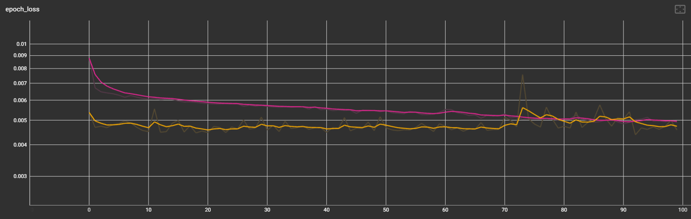

프로토타입.

--들어간 X 데이터-- 
-시가, 고가, 저가, 종가 (원화 절대값) 
-등락률 (%) 
-거래량

--들어간 Y 데이터-- 
-7일이내 최대 상승률(%) 
--(향후추가) 
-7일이내 최대 하락률 (%) 
-7일이내 3%이상 상승여부 (0, 1) 
-7일이내 -3%이하 하락여부 (0, 1)

--정규화 과정 
-시가~종가의 데이터는 4개의 피처중 최고, 최저값을 기준으로 스케일링 
-이외의 데이터는 각각 스케일링

--모델 Hyperparameter-- 
-레이어수, 유닛수, 배치사이즈, 시퀀스길이, 학습률
-Loss Function: Mean Squared Error (MSE) #평균제곱오차 
-Optimizer: Adam 
 
 
 
 
학습결과 ( loss: 분홍색 / val_loss: 노란색 )
-

- 초반 5에포크까지 하락하다 loss는 서서히줄고 val_loss는 평평한 모습 -> 과적합 초기증상?
- 70에포크정도에서 val_loss급증 확인 -> 과적합