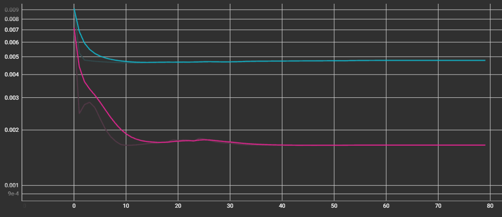

# Regularization（正則化）適用

> **目的**  
> ドロップアウトで解決できなかった過学習を解消するため、**各LSTMレイヤーにL2正則化**を適用して学習を実施。

---

## 1. 概要
| 項目 | 内容 |
| ---- | ---- |
| **基準モデル** | `25-06-24_dropout` |
| **変更点** | すべての LSTM 層に `regularizers` を追加   `shuffle=False` に変更 |
| **評価指標** | `loss`, `val_loss` (MSE) |

---

## 2. 変更点の詳細
* **Regularization**: L2  
* **適用位置**: 各LSTMレイヤー  
* **シャッフル**: False に設定 
  -> 時系列データのため、先頭80%を訓練用・後ろ20%を検証用としてデータをシャッフルせずに検証。  
* **その他のハイパーパラメータ**: 既存と同一

---

## 3. 結果概要

| 区分 | 過学習 (Epoch) | `loss` の推移 | `val_loss` の推移 |
| ---- | ------------- | ------------- | ----------------- |
| **Before** | ≈ **100 Epoch** | **継続下降** | 横ばい → 急上昇（依然として過学習） |
| **After (Regularization)** | ≈ **未確認** | **10 Epochまで低下後横ばい** | 15 Epochまで低下後横ばい |

---

## 4. 観察された特徴
1. **過学習解消**  `loss` と `val_loss` の両方が 10〜15 Epoch まで低下後、一定値で横ばい。  
2. **損失値の安定**  急増の兆しなく 80 Epoch まで横ばいを確認。  

---

## 5. 今後の課題
* `loss` を 0.005 以下に確実に減らす方法を模索。  
* 学習率が 1e-6 まで低下したら学習完了と判断し、学習を早期停止。  

---

## 6. グラフ比較

### 適用前 (loss: グリーン, val_loss: オレンジ)

### 正則化および `shuffle=False` 適用後 (loss: ブルー, val_loss: ピンク)

---

 
 
 
 
 
 
 
 
 
 
 
 
 

# Regularization정규화 적용

> **목적**
> 드롭아웃으로 해결안된 과적합을 없애기 위해 **각 LSTM레이어에 L2정규화**를적용하여 학습을 진행함. 

---

## 1. 개요
| 항목        | 내용                           |
| --------- | ---------------------------- |
| **기준 모델** | `25-06-25_dropout`         |
| **변경 사항** | 모든 LSTM 층에 `regularizers` 추가   `shuffle=False`로 변경|
| **평가 지표** | `loss`, `val_loss` (MSE)     |

---

## 2. 변경 사항 상세
* **Regularization**: L2
* **적용 위치**: 각 LSTM 레이어
* **셔플링**: False로 설정 
-> 시계열데이터 이기에, 앞의 데이터 80%를 훈련용, 뒤의 20%를 검증용으로 데이터를 셔플하지않고 검증하도록 변경.
* **나머지 하이퍼파라미터**: 기존과 동일

---

## 3. 결과 요약

| 구분                  | 과적합(Epoch)      | `loss` 추세         | `val_loss` 추세      |
| ------------------- | --------------- | ----------------- | ------------------ |
| **Before**          | ≈ **100 Epoch**  | **지속 하락** | 평평 → 급상승 (여전히 과적합)          |
| **After (Regularization)** | ≈ **확인 안됨** | **10 Epoch까지 허럭후 평평**         | 15 Epoch까지 허럭후 평평 |

---

## 4. 관찰된 특징
1. **과적합 해결** `loss`와 `val_loss`모두 10~15에포크까지 하락후 특정값에서 평평.
2. **손실값 안정** 급증하는 낌새없이 80에포크까지 평평한 모습 확인가능.

---

## 5. 다음 과제

* `loss`를 0.005이하로 확실하게 줄일방법 모색.
* 학습률이 1e-6까지 하락하면 학습이 완료된거로 판단하여 학습 조기 중단.
---

## 6. 그래프 비교

### 적용전 (loss: 녹색, val_loss: 주황색)

### Regularization, `shuffle=False`적용후 (loss: 파란색, val\_loss: 핑크색)

---