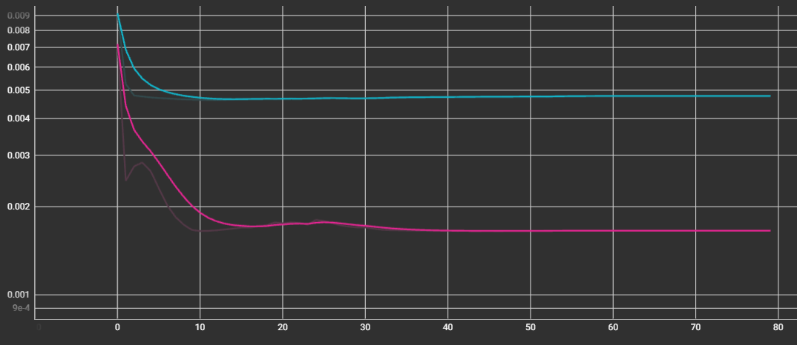
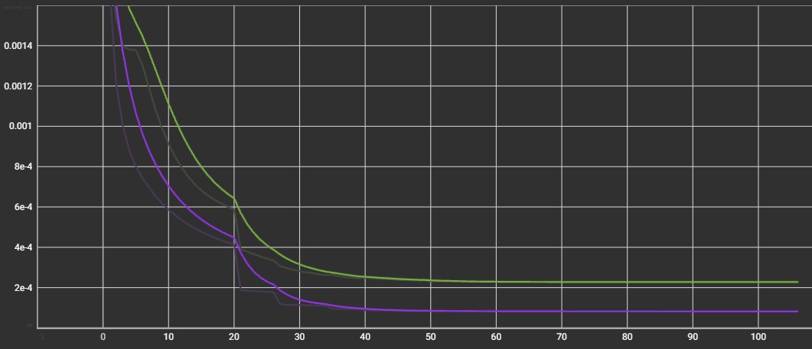

# ターゲットスケール変更

> **目的**  
> 既存の Y 値「現在価格を基準に今後 7 日以内に最大 **何 %** 上昇するか」から **最高値はいくらか** に変更し、`loss` を観察する。

---

## 1. 概要
| 項目 | 内容 |
| ---- | ---- |
| **基準モデル** | `25-06-25_regularization` |
| **変更点** | Y データを `%` から **価格の絶対値** へ変更 |
| **評価指標** | `loss`, `val_loss` (MSE) |

---

## 2. 変更点の詳細
* **Y データ**: 以前は **3 %** を保存していたものを **59 000 ₩** のように保存  
* **適用対象**: Y データ  
* **その他ハイパーパラメータ**: 既存と同一

---

## 3. 結果概要

| 区分 | 過学習 (Epoch) | `loss` の推移 | `val_loss` の推移 |
| ---- | ------------- | ------------- | ----------------- |
| **Before** | **未確認** | **10 Epoch まで低下後 0.005 付近で横ばい** | 15 Epoch まで低下後 **0.0017** 付近で横ばい |
| **After (Rescaling)** | **未確認** | **50 Epoch まで低下後 8.6e-5 付近で横ばい** | 50 Epoch まで低下後 **2.34e-4** 付近で横ばい |

---

## 4. 観察された特徴
1. **損失値の大幅低下**  `loss` が **0.005** 付近から **0.000086** まで低下。  
2. **損失値の安定**  急増の兆しなく 100+ Epoch まで横ばいを維持。

---

## 5. 今後の課題
* 学習済みモデルで実際の値とどれほど類似するか確認する。

---

## 6. グラフ比較

### 適用前 (loss: ブルー, val_loss: ピンク)

### 適用後 (loss: パープル, val_loss: グリーン)

---

 
 
 
 
 
 
 
 
 
 
 
 

# 타겟 스케일 변경

> **목적**  
> 기존의 Y값인 현재가기준 앞으로 7일이내 최대 **몇%** 오를지 에서 **최고값은 얼마**인지로 변경후 loss관찰.

---

## 1. 개요
| 항목        | 내용                           |
| --------- | ---------------------------- |
| **기준 모델** | `25-06-25_regularization`         |
| **변경 사항** | Y데이터를 `%`에서 `가격 절대값`으로 변경 |
| **평가 지표** | `loss`, `val_loss` (MSE)     |

---

## 2. 변경 사항 상세
* **Y데이터**: 기존 **3**% 로 저장하던것을 **59000**원식으로 저장 
* **적용 위치**: Y데이터
* **나머지 하이퍼파라미터**: 기존과 동일

---

## 3. 결과 요약

| 구분                  | 과적합(Epoch)      | `loss` 추세         | `val_loss` 추세      |
| ------------------- | --------------- | ----------------- | ------------------ |
| **Before**          | **확인 안됨**  | **10 Epoch까지 허럭후 0.005부근에서 평평**  | 15 Epoch까지 허럭후 **0.0017**부근에서 평평         |
| **After (Rescaling)** | ≈ **확인 안됨** | **50 Epoch까지 허럭후 8.6e-5부근에서 평평**         | 50 Epoch까지 허럭후 **2.34e-4**부근에서평평 |

---

## 4. 관찰된 특징
1. **손실값 급락** `loss`를 **0.005**정도에서 **0.000086**까지 낮춰짐.
2. **손실값 안정** 급증하는 낌새없이 100+에포크까지 평평한 모습 확인가능.

---

## 5. 다음 과제

* 학습된 모델로 실제값과 얼마나 유사한지 확인.
---

## 6. 그래프 비교

### 적용전 (loss: 파란색, val\_loss: 핑크색)

### 적용후 (loss: 보라색, val\_loss: 초록색)

---