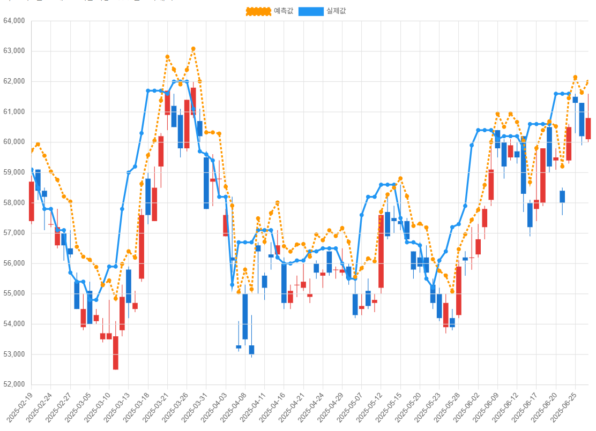

# v1モデル テスト

> **目的**  
> AI が予測したデータと実際のデータの差を確認し、予測データの特徴を把握する。

---

## 概要
| 項目 | 内容 |
| ---- | ---- |
| **学習銘柄** | 삼성전자 (005930) (韓国の株)|
| **Xデータ** | 始値、高値、安値、終値、騰落率、 出来高、個人／外国人／機関／プログラム純買い、 空売り関連データ |
| **Yデータ** | 6 営業日以内の最高値（価格の絶対値） |
| **予測期間** | 2006-10-04 ～ 2025-06-25 |

---

## 観察された特徴
* 実際の株価の流れと大差なし  
* 上昇局面ではより高い価格を予測（慣性のような予測傾向）  
* 下落後の反発局面を予測できない  

---

## 次の課題
* 株価のトレンドをほぼ追随する理由を特定し解消  
  → 現時点での疑い：Y データを価格絶対値で与えた点 → **相対値** に切り替える  
* 良質なデータを X データに追加（MACD、ボリンジャーバンド、移動平均線など）

---

## 予測結果（予測値：オレンジ点線、実測値：青実線）

 
 
 
 
 
 
 
 
 
 
 

# v1모델 테스트

> **목적**  
> ai가 예측한데이터와 실제 데이터의 차이를 확인, 예측한 데이터의 특징을 확인

---

## 개요
| 항목        | 내용                           |
| --------- | ---------------------------- |
| **학습 종목** | 삼성전자(005930) |
| **X데이터** | 시가, 고가, 저가, 종가, 등락률, 거래량, 개인/외국인/기관/프로그램순매수, 공매도 관련 데이터들
| **Y데이터** | 6거래일 이내의 최고가 (가격 절대값)    |
| **예측 기간** | 2006-10-04~2025-06-25   |

---

## 관찰된 특징
* 주가의 흐름과 크게 차이가 없음.
* 상승할때는 더 높은 가격을 예측 ( 관성같은 느낌으로 예측? )
* 하락후 반등시에 예측을 못함.

---

## 다음 과제

* 주가의 추세를 거의 따라가는 이유를 찾고 해결.   
  ->일단 의심되는것은 Y데이터로 가격 절대값을 준것 -> Y데이터를 **상대값**으로 변경
* 양질의 데이터를 X데이터로 추가 (MACD, 볼린저밴드, 이평선등..)

---

## 예측 결과 (예측값: 주황색 점선, 실제값: 파란색 실선)
